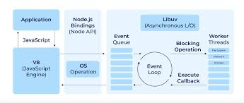
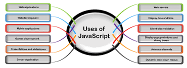
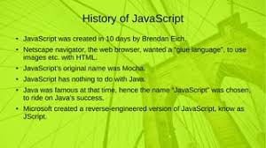
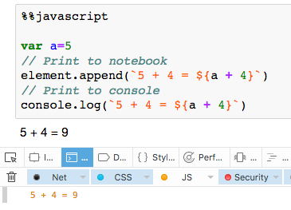
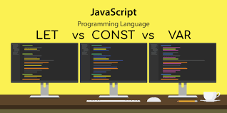
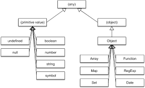
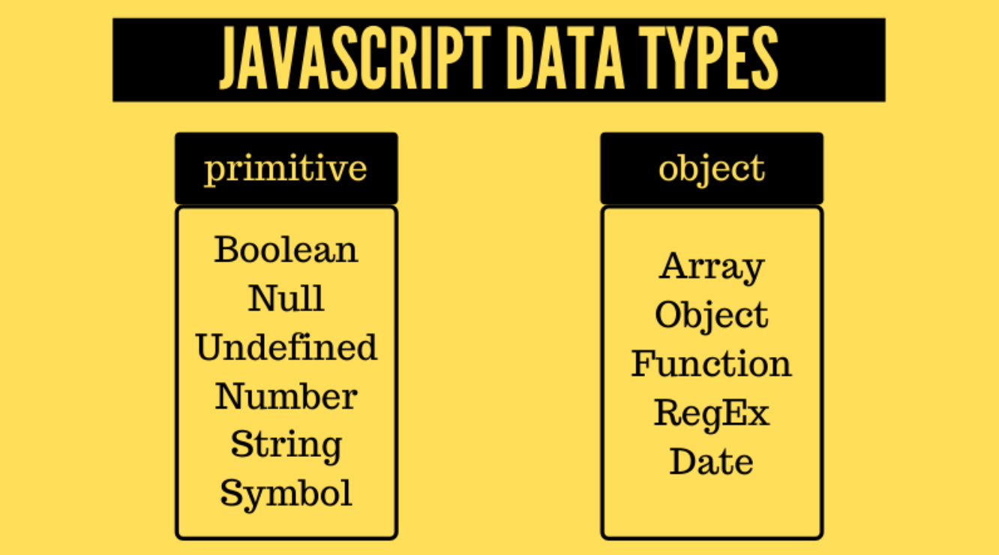
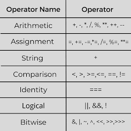

"# Lecture_1" 
# What is js?
## JavaScript (JS) is a lightweight interpreted (or just-in-time compiled) programming language with first-class functions. While it is most well-known as the scripting language for Web pages, many non-browser environments also use it, such as Node.js, Apache CouchDB and Adobe Acrobat

# HOW jS WORK?
## So you may know that your code somehow compiles and executes in your browser to display the beautiful web application you’ve built. But are you aware of all the components that come into play to enable the output?Let’s dive a little into JavaScript behind the scenes. The abstract part that you can’t exactly see.Why should a seemingly abstract subject matter to you? An understanding of the inner workings of JavaScript allows you to explore the language beyond the surface level and from a deeper perspective.

# THE ROLE OF JS IN WED DEVELOPMENT
## What Is JavaScript? JavaScript (JS) is a cross-platform, object-oriented programming language used by developers to make web pages interactive. It allows developers to create dynamically updating content, use animations, pop-up menus, clickable buttons, control multimedia, etc.

# Whan js was fonded?
## JavaScript was invented by Brendan Eich in 1995. It was developed for Netscape 2, and became the ECMA-262 standard in 1997. After Netscape handed JavaScript over to ECMA, the Mozilla foundation continued to develop JavaScript for the Firefox browser
.
# Run code
## It is worth mentioning that frameworks like React, Angular, Svelte, etc will take care of the building & running of your app automatically and provide framework-specific tooling and steps for running code. In the real world, you are more likely to use the tooling provided by the framework to run your code, as opposed to the basic methods shown in this couse.

# JS VERIABLES AND CONSTANDS
## Variables in javascript can be declared using "var" and "let" keywords. The major difference between declaring variables using var and let is that "var" has global scope whereas "let" has a local scope. Constants in Javascript are used to store values that don't change. They are declared using "const" keyword.

# That's another interesting point! Primitive Types have no methods but, except for null and undefined , they all have object equivalents that wrap the primitive values then we're able to use methods

 
 ## THE ROLES OF NAMING JS VEREABLES
 ## Variable names are pretty flexible as long as you follow a few rules: Start them with a letter, underscore _, or dollar sign $. After the first letter, you can use numbers, as well as letters, underscores, or dollar signs. Don't use any of JavaScript's reserved keywords.
 
 # JS OPERATORS
 ## JavaScript Operators are symbols used to perform specific mathematical, comparison, assignment, and logical computations on operands. They are fundamental elements in JavaScript programming, allowing developers to manipulate data and control program flow efficiently. Understanding the different types of operators and how they work is important for writing effective and optimized JavaScript code.
 